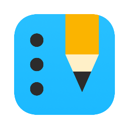

  

  <h3 align="center" style = "margin-top: 5px;">SLog</h3>

  

    An easy-to-use web app that offers various study tools
     
    <a href="https://studylog.netlify.app/"><strong>Explore the app »</strong></a>
     
     
    <a href="https://github.com/kwsong0113/study-log-api">Backend Repo</a>
    ·
    <a href="https://github.com/kwsong0113/study-log/issues">Report Bug</a>
    ·
    <a href="https://github.com/kwsong0113/study-log/issues">Request Feature</a>
  

  
Table of Contents

  <ol>
    <li>
      <a href="#about-the-project">About The Project</a>
      <ul>
        <li><a href="#built-with">Built With</a></li>
      </ul>
    </li>
    <li>
      <a href="#app-summary">App Summary</a>
      <ul>
        <li><a href="#tools">Tools</a></li>
        <li><a href="#main-functionalities">Main Functionalities</a></li>
        <li><a href="#features">Features</a></li>
      </ul>
    </li>
    <li><a href="#usage">Usage</a></li>
    <li><a href="#versions--changelogs">Versions & Changelogs</a></li>
    <li><a href="#contact">Contact</a></li>
    <li><a href="#acknowledgments">Acknowledgments</a></li>
  </ol>

## About The Project

There are many great note taking, to-do list apps such as EverNote, OneNote, and Google Tasks, but they didn't perfectly suit my needs. I wanted to create a simple study app that I can easily use on a daily basis.

_I focused on three points while developing SLog:_
* Simple, concise, and beautiful UI
* Sharable, accessible on any device
* Provide convenient and easy-to-use tools that can help studying efficiently

### Built With

#### Frameworks / Libraries / Database

 

#### Design / Authentication / Deployment

 

(<a href="#top">back to top</a>)

## App Summary

#### Tools
* Study Log
  * Summarize what you learned and write it as a concise study log everyday
* Todos
  * Takes notes, Create a study plan, to-do list and learning goals
* Community
  * Can view other's study logs and todos

#### Main Functionalities
* Study Log Editor
  * A real-time study log editor that works similarly to Markdown
* Date Selector
  * If a user selects a date on the calendar, scroll to the selected date's study log
* Subject Filter
  * Only show study logs related to the selected subject

#### Features
* Fully responsive design
* Customizable theme UI
* Sharable & accessible on any device
* Installable PWA

(<a href="#top">back to top</a>)

## Usage

#### Examples

(<a href="#top">back to top</a>)

## Versions & Changelogs
#### 0.0.0 (April 26, 2022)
* Initial public release

## Contact

#### Email
* Kiwhan Song - kiwhan@mit.edu / helloing.develop@gmail.com

#### GitHub Repositories
* Frontend: https://github.com/kwsong0113/study-log
* Backend: https://github.com/kwsong0113/study-log-api

(<a href="#top">back to top</a>)

## Acknowledgments

* [React Docs](https://reactjs.org/)
* [Mui Docs](https://mui.com/)
* [Building a REST API with Express, Node, and MongoDB](https://www.mongodb.com/languages/express-mongodb-rest-api-tutorial)
* [Markdown Guide](https://www.markdownguide.org/)

(<a href="#top">back to top</a>)
